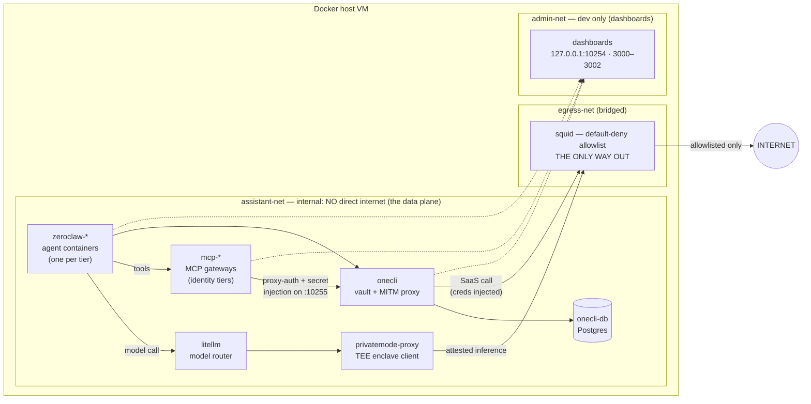

# Secure Assistant Stack

 

**A security and privacy conscious approach to running ZeroClaw in Virtual Machines**
> composes proven open-source building blocks under one default-deny roof. Adds a tier model and bring-up automation on top. It does **not** reinvent sandboxing or secret injection.
>
> | Component | Role |
> |-----------|------|
> | [ZeroClaw](https://github.com/zeroclaw-labs/zeroclaw) | the agent runtime — one container per tier |
> | [OneCLI](https://github.com/onecli/onecli) | credential vault + man-in-the-middle (MITM) proxy that swaps placeholders for real secrets on the wire |
> | [LiteLLM](https://github.com/BerriAI/litellm) | model router |
> | [PrivateMode](https://privatemode.ai) | TEE-confidential inference enclave |
> | [Squid](https://github.com/ubuntu/squid) | default-deny, allowlisted egress (the only way out) |
> | [Multipass](https://multipass.run) | one-command Ubuntu VM for Mac dev |
>
> **Status:** pilot — validated on macOS + Multipass. Other platforms (Multipass-on-Linux, libvirt/VirtualBox, Docker-on-host) are untested, and Tailscale-based dashboard access is planned. See [Usage options](#usage-options-not-yet-tested).

### ***[Start here](#usage)** to spin up your Assistant Stack VM*
>
> ```bash
> ./launch-multipass.sh --local && multipass shell assistant
> ```

## Contents

- [Why](#why) · [Features](#features) · [Requirements](#requirements)
- [Usage](#usage) · [Architecture](#architecture) · [Configuration](#configuration)
- [VM details](#vm-details) · [Usage options](#usage-options-not-yet-tested)
- [Roadmap](#roadmap) · [Contributing](#contributing) · [License](#license)
- **Deeper docs:** [Security model](docs/SECURITY.md) · [Comparison with similar projects](docs/COMPARISON.md)

---

## Why

The "lethal trifecta" for an agent is any two of: access to private data, exposure to untrusted content, and the ability to communicate externally. Most agent setups hand it all three. This stack tries to remove two of the three **by construction** — the agent has **no direct internet** (every byte goes through an allowlist) and **no raw credentials** (the vault injects per-request, scoped tokens). Full threat model in [docs/SECURITY.md](docs/SECURITY.md).

**What's actually been achieved.** The *containment substrate* is built and self-checking: the supporting stack and all three tiers come up, the TEE model path reaches PrivateMode and returns, the default-deny floor holds (allowlisted hosts pass, everything else is 403), tool containers inside the sandbox can't reach the network, and `scripts/preflight.sh` reports `FAIL=0`. The security architecture — the actual point of the pilot — is in place and verifiable.

**What this is *not* yet.** A proven, day-to-day assistant. The end-to-end path — a channel bound (WhatsApp/Signal), a real brokered tool call succeeding through OneCLI, the agent answering you over chat — is the *next* milestone, not a finished one. The threat-model claims describe the design; live validation that "the agent does useful work and still can't exfiltrate" is tracked in [Roadmap](#roadmap).

**Scope.** A single-user, self-hosted pilot: dev on macOS + Multipass today, aimed at a permanent Linux/ProxMox/NAS VM tomorrow. It is **not** hardened for multi-tenant or hostile use yet (see the "Not mitigated" rows in [docs/SECURITY.md](docs/SECURITY.md) and the Roadmap).

## Features

- **Default-deny egress** — no host internet; every outbound packet is evaluated against `squid/allowlist.txt`.
- **Zero raw credentials** — OneCLI injects scoped, per-request tokens at the proxy layer; the agent only ever sees placeholders.
- **TEE-confidential inference** — model calls route through a hardware enclave (PrivateMode), not a plain API.
- **Tiered identities** — N agents, each with its own identity, Model Context Protocol (MCP) tools, command allowlist, and blast radius. Three ship by default: `updates`, `tasks`, `unrestricted`.
- **Contained tool sandbox** — the unrestricted tier runs shell/file tools inside a sandboxed Docker-in-Docker (DinD) daemon with no external network.
- **One-command bring-up** — `launch-multipass.sh --local` provisions the VM; `bring-up.sh` starts and wires the whole stack.
- **Verifiable by design** — `scripts/preflight.sh` asserts the floor holds, certs are mounted, MCP gateways are authenticated, and the egress floor holds (no direct model-provider or internet leak).

## Usage

### Requirements

- [Multipass](https://multipass.run) – `brew install multipass`. Linux VM options below.
- [PrivateMode](https://privatemode.ai) API key – LiteLLM can fall back to any less-secure OpenAI-compatible endpoint without it
- SaaS credentials (Gmail, Marvin, etc.) – Needed only for identity-bearing tiers (updates, tasks)

The whole stack comes up with one VM + one script. **Steps 1–3 run on your Mac; steps 4–6 run inside the VM as the `assistant` service account** — that's the only account with docker + `.env` access (`multipass shell` drops you in as `ubuntu`, so switch once with `sudo -iu assistant`). No per-command `sudo` is needed after that switch.

#### 1. Get the repo  · *Mac*

```bash
git clone https://github.com/bgheneti/zeroclaw-secure-stack.git
cd zeroclaw-secure-stack
```

#### 2. Configure  · *Mac*

```bash
cp .env.example .env      # fill in the placeholders (encryption key, API keys…)
$EDITOR tiers.yaml        # optional: add/remove tiers, identities, ports, tools
```

> The 3 default tiers work out of the box. OneCLI identity tokens are **not** set here — `bring-up.sh` provisions them automatically (step 4).

#### 3. Launch the VM  · *Mac*

```bash
./launch-multipass.sh --local
```

Provisions an Ubuntu VM named `assistant`, transfers the repo + `.env` into `/opt/assistant-stack`, and creates the `assistant` service account. It does **not** start the stack — that's the next step.

#### 4. Start the stack  · *VM, as `assistant`*

```bash
multipass shell assistant     # on the Mac — you're now `ubuntu` in the VM
sudo -iu assistant            # switch to the service account (docker + .env access)
cd $STACK_DIR
bash /opt/bring-up.sh
```

`bring-up.sh` is one idempotent script: it generates tier configs from `tiers.yaml`, starts the supporting stack (Squid, OneCLI, LiteLLM, PrivateMode), **auto-creates the OneCLI identities and writes their `aoc_` tokens into `.env`** (`scripts/provision-identities.py`), exports the OneCLI CA, starts the agent tiers, injects secrets into per-tier configs, and builds the DinD sandbox image. Re-run it any time after editing `.env`/`tiers.yaml` (~2–4 min on first run).

#### 5. Verify  · *VM, as `assistant`*

```bash
bash scripts/preflight.sh                                  # goal: FAIL=0
docker compose exec zeroclaw-updates zeroclaw doctor       # agent + MCP health
```

#### 6. Authorize SaaS + bind a channel  · *the only manual part*

Identities + tokens are now provisioned automatically; what's still hands-on is the SaaS connection behind each identity, then binding a messaging channel:

```bash
# OneCLI dashboard (forward from the Mac): ssh -L 10254:127.0.0.1:10254 ubuntu@<vm-ip>
#   Settings → Connections: connect Gmail -> 'personal'; paste Marvin API key -> 'tasks'
docker compose exec zeroclaw-updates zeroclaw channel start
```

> Prefer to create identities / grab tokens by hand? The dashboard's **Settings → Agents** page lists each identity and its `aoc_` token. The automatic flow uses the same OneCLI API — see `scripts/provision-identities.py`.

The agent now reaches your SaaS accounts through OneCLI's MITM proxy (no raw credentials) and runs inference through a TEE enclave.

## Architecture


> The **solid** arrows are the data plane — notice they all funnel through Squid, which is the only thing bridging `assistant-net` to the internet. The **dashed** arrows are dev-only dashboard reach via `admin-net`; on a real Linux host that net is unnecessary (dashboards bind loopback).

Default 3 tiers: **updates** (WhatsApp, Gmail, identity `personal`), **tasks** (Signal, Marvin, identity `tasks`), **unrestricted** (shell/file tools, no SaaS creds, sandboxed in DinD).

## Configuration

**`tiers.yaml`** — define N tiers, each with identity, MCP gateway, port, command allowlist, sandbox flag. Edit this, re-run `generate-tiers.py`.

**`.env`** — OneCLI tokens (one per identity — **auto-written** by `bring-up.sh`), MCP gateway tokens, LiteLLM master key, PrivateMode key, DB password. Fill in before launching the VM.

**`squid/allowlist.txt`** — default-deny egress. Add domains your tools need.

**`mcp/<tier>/`** — per-tier MCP gateway config (registry.yaml, secrets, catalog).

## VM details

### Management  · *Mac*

| Action | Command |
|--------|---------|
| Create with local state (recommended) | `./launch-multipass.sh --local` |
| Create (clone from GitHub) | `./launch-multipass.sh` |
| Get a shell | `multipass shell assistant` |
| Tunnel dashboards to the Mac | `ssh -L 10254:127.0.0.1:10254 ubuntu@<vm-ip>` *(loopback, not admin-net IP; add `-L 3000:127.0.0.1:3000` … per tier)* |
| Update the stack | pull on the Mac → `./launch-multipass.sh --local` again (or edit in-VM) → `bash /opt/bring-up.sh` |
| Watch bring-up logs | `multipass exec assistant -- journalctl -u cloud-final -f` |
| Teardown | `multipass delete assistant && multipass purge` |

### Debugging  · *VM, as `assistant`*

> Everything in this table runs **inside the VM as `assistant`** (`sudo -iu assistant; cd $STACK_DIR`). To run the same from the Mac without a shell, prefix with `multipass exec assistant -- sudo -iu assistant -- `.

| Check this | Command |
|---|---|
| Container statuses | `docker compose ps` |
| Tier logs | `docker compose logs --tail=50 zeroclaw-<tier>` |
| Agent health | `docker compose exec zeroclaw-<tier> zeroclaw doctor` |
| Bind channel | `docker compose exec zeroclaw-<tier> zeroclaw channel start` |
| Full validation | `bash scripts/preflight.sh` |
| Restart a tier | `docker compose restart zeroclaw-<tier>` |

### Known quirks

- **MCP token mismatch:** if `zeroclaw doctor` shows no MCP connection, the gateway token doesn't match `.env`. Re-run `bash /opt/bring-up.sh` (it regenerates configs and re-injects secrets).
- **Sandbox build needs egress allowlist entries:** the DinD sandbox image builds *inside* the contained DinD daemon, so `squid/allowlist.txt` must include the build-time registries/CDNs (Docker Hub, Chainguard/R2, `packages.wolfi.dev`, npm, GitHub). For prod, build in CI and publish to ghcr.io, then allowlist only `ghcr.io`.
- **macOS networking:** `internal: true` Docker networks block host→container routing on macOS, so an `admin-net` bridge carries dashboard traffic. Not needed on real Linux (dashboards bind loopback; reach over SSH/on-box).
- *(Implementation details — the OneCLI CA export race, the `127.0.0.1` healthcheck, the MCP gateway `--block-network` flag — are documented as comments in `bring-up.sh`, `docker-compose.yml`, and `generate-tiers.py`.)*

## Roadmap

The pilot is architecturally complete but operationally young — roughly in priority order:

**Validate the promise (near-term)**
- Bind the messaging channels end-to-end: WhatsApp web-mode pairing for the `updates` tier, and **Signal via `signal-cli`** for `tasks` (a `signal-cli` service still needs adding to the stack — the tier is wired for it, the daemon isn't yet).
- Complete the first **brokered tool call** through OneCLI (e.g. Gmail via `mcp-personal`) and confirm the agent never sees the real token.
- Per-tier isolation tests: `tasks` cannot reach Google; `unrestricted` has no SaaS creds.
- Finish `scripts/verify-no-anthropic.sh` — assert no Anthropic provider in any config, provider `base_url` is LiteLLM, and Squid shows zero Anthropic egress.

**Access — Tailscale**
- Replace the SSH-tunnel + `admin-net` workaround with **Tailscale** SSH + MagicDNS: a Tailscale sidecar on `admin-net` (it dials out, needs no inbound port) and *off* the data-plane `assistant-net`. Solves Mac→dashboard routing cleanly and gives identity-based access to the dashboards.

**Confidentiality — pluggable TEE providers**
- Add **[Tinfoil](https://tinfoil.sh/)** (and other attested-inference providers) as a LiteLLM fallback behind the same allowlist, so you're not locked to PrivateMode. (`squid/allowlist.txt` already reserves the spot under "DEFERRED".)

**Production hardening**
- Move to a permanent **Linux VM** via the same `user-data.yaml` as a NoCloud seed (dev/prod parity).
- Pin every image by digest; add LiteLLM Postgres for **virtual keys + budgets**; tighten DinD (TLS on 2376, or a dedicated network) instead of unauthenticated 2375 on `assistant-net`; carry secrets as files rather than env vars.

**Supply chain (closes "Not mitigated" gaps)**
- SBOM / package scanning for tool images, and content inspection on allowlisted egress.

**Maybe**
- Per-tier DinD sidecars for the identity tiers (full sandbox parity for `updates`/`tasks`).
- A "compounding lessons" memory flow: a scheduled reflection job that distils sessions into a `LESSONS.md` the agent reloads.

## Usage options (not yet tested)

The stack has only been validated on macOS + Multipass. Promising untested alternatives:

- **Multipass on Linux** — `snap install multipass` then the same `launch-multipass.sh` flow.
- **libvirt / VirtualBox** — seed `user-data.yaml` via cloud-init on any Ubuntu 22.04+ VM.
- **Docker directly on host** — clone the repo, `export COMPOSE_FILE=docker-compose.yml:docker-compose.tiers.yml`, `docker compose up -d`. Missing: `bring-up.sh` automation, cloud-init, the multipass file transfer.
- **Tailscale** (planned) — replace SSH tunnels with Tailscale SSH + MagicDNS for dashboard access. Eliminates the `ssh -L` step. See [Roadmap](#roadmap).

## Contributing

Contributions are welcome. This is currently a small pilot — open an issue first to discuss the change you'd like to make. Please do not file public issues for security vulnerabilities; see [docs/SECURITY.md](docs/SECURITY.md) and email the maintainer privately instead. A `CONTRIBUTING.md` and `CODE_OF_CONDUCT.md` will be added as the project grows.

## License

This project does not yet declare a license. Until a `LICENSE` file is added, the source here is **all rights reserved**. (Picking an OSI license — e.g. MIT or Apache-2.0, matching the components this composes — is a recommended next step before broad sharing.)
