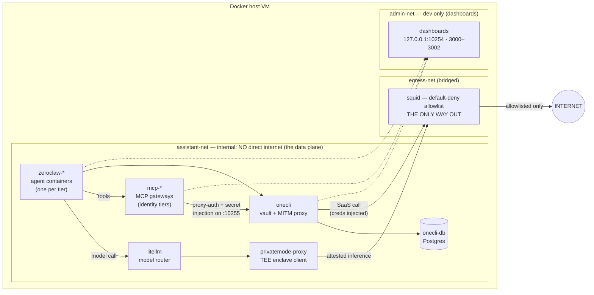

# Secure Assistant Stack

 

**Self-hosted AI agent *tiers* (one isolated agent per identity) with no unfiltered egress and zero raw credentials.** The agent reaches your SaaS integrations only through a credential vault that injects scoped tokens on the wire — it never holds the keys. Inference runs through a Trusted Execution Environment (TEE) enclave.

> **What this is.** A reference deployment that composes proven open-source building blocks under one default-deny roof, plus the tier model and bring-up automation on top. It does **not** reinvent sandboxing or secret injection.
>
> | Component | Role |
> |-----------|------|
> | [ZeroClaw](https://github.com/zeroclaw-labs/zeroclaw) | the agent runtime — one container per tier |
> | [OneCLI](https://github.com/onecli/onecli) | credential vault + man-in-the-middle (MITM) proxy that swaps placeholders for real secrets on the wire |
> | [LiteLLM](https://github.com/BerriAI/litellm) | model router |
> | [PrivateMode](https://privatemode.ai) | TEE-confidential inference enclave |
> | [Squid](https://github.com/ubuntu/squid) | default-deny, allowlisted egress (the only way out) |
> | [Multipass](https://multipass.run) | one-command Ubuntu VM for Mac dev |
>
> **Status:** pilot — validated on macOS + Multipass. Other platforms (Multipass-on-Linux, libvirt/VirtualBox, Docker-on-host) are untested, and Tailscale-based dashboard access is planned. See [Usage options](#usage-options-not-yet-tested).

## Contents

- [Why](#why) · [Features](#features) · [Requirements](#requirements)
- [Primary workflow](#primary-workflow-configure--build--provision--use) · [Architecture](#architecture) · [Security model](#security-model)
- [Configuration](#configuration) · [VM details](#vm-details) · [Usage options](#usage-options-not-yet-tested)
- [Roadmap](#roadmap) · [How this relates to similar projects](#how-this-relates-to-similar-projects) · [Contributing](#contributing) · [License](#license)

---

## Why

The "lethal trifecta" for an agent is any two of: access to private data, exposure to untrusted content, and the ability to communicate externally. Most agent setups hand it all three. This stack tries to remove two of the three **by construction** — the agent has **no direct internet** (every byte goes through an allowlist) and **no raw credentials** (the vault injects per-request, scoped tokens). [Full threat model below →](#security-model)

**What's actually been achieved.** The *containment substrate* is built and self-checking: the supporting stack and all three tiers come up, the TEE model path reaches PrivateMode and returns, the default-deny floor holds (allowlisted hosts pass, everything else is 403), tool containers inside the sandbox can't reach the network, and `scripts/preflight.sh` reports `FAIL=0`. The security architecture — the actual point of the pilot — is in place and verifiable.

**What this is *not* yet.** A proven, day-to-day assistant. The end-to-end path — a channel bound (WhatsApp/Signal), a real brokered tool call succeeding through OneCLI, the agent answering you over chat — is the *next* milestone, not a finished one. The threat-model claims describe the design; live validation that "the agent does useful work and still can't exfiltrate" is tracked in [Roadmap](#roadmap).

**Scope.** A single-user, self-hosted pilot: dev on macOS + Multipass today, aimed at a permanent Linux/ProxMox/NAS VM tomorrow. It is **not** hardened for multi-tenant or hostile use yet (see the "Not mitigated" rows and the Roadmap).

## Features

- **Default-deny egress** — no host internet; every outbound packet is evaluated against `squid/allowlist.txt`.
- **Zero raw credentials** — OneCLI injects scoped, per-request tokens at the proxy layer; the agent only ever sees placeholders.
- **TEE-confidential inference** — model calls route through a hardware enclave (PrivateMode), not a plain API.
- **Tiered identities** — N agents, each with its own identity, Model Context Protocol (MCP) tools, command allowlist, and blast radius. Three ship by default: `updates`, `tasks`, `unrestricted`.
- **Contained tool sandbox** — the unrestricted tier runs shell/file tools inside a sandboxed Docker-in-Docker (DinD) daemon with no external network.
- **One-command bring-up** — `launch-multipass.sh --local` provisions the VM; `bring-up.sh` starts and wires the whole stack.
- **Verifiable by design** — `scripts/preflight.sh` asserts the floor holds, certs are mounted, MCP gateways are authenticated, and the egress floor holds (no direct model-provider or internet leak).

## Requirements

| Resource | Required | Notes |
|----------|----------|-------|
| [Multipass](https://multipass.run) | Yes (Mac primary path) | `brew install multipass`. Linux VM options below. |
| Docker + Compose plugin | No | Auto-installed inside the VM by bring-up.sh. |
| [PrivateMode](https://privatemode.ai) API key | No | LiteLLM can fall back to any OpenAI-compatible endpoint without it. |
| SaaS credentials (Gmail, Marvin, etc.) | No | Needed only for identity-bearing tiers (updates, tasks). |

## Primary workflow (configure → build → provision → use)

> **Where to run each command.** Steps 0–3 run on your **Mac** (the host with Multipass). Steps 4–6 run **inside the VM** (`multipass shell assistant`), or equivalently from the Mac via `multipass exec assistant -- …`. Each step below shows both forms.

```bash
# 0. Get the repo (on the Mac)
git clone https://github.com/bgheneti/zeroclaw-secure-stack.git && cd zeroclaw-secure-stack

# 1. Configure tiers (optional — the 3 default tiers work out of the box)
cp .env.example .env        # fill in placeholders
vim tiers.yaml              # add/remove tiers, change identities, ports, tools

# 2. Preview the generated compose + tier configs (OPTIONAL — bring-up.sh
#    runs this same generator inside the VM; do this only to validate tiers.yaml
#    locally first. Requires python3 + pyyaml.)
python3 scripts/generate-tiers.py

# 3. Launch the VM (on the Mac)
./launch-multipass.sh --local   # renders cloud-init, launches VM, transfers repo + .env
```

`launch-multipass.sh` creates an Ubuntu VM named `assistant`, clones/transfers the
repo into `/opt/assistant-stack`, and seeds `.env`. It also creates an **`assistant`
service account** (used to own the repo + run the stack) alongside Multipass's
default `ubuntu` user — that's why later steps edit files as `sudo -u assistant`.
It does **not** start the stack — that's the next step. Get a shell on the VM:

```bash
multipass shell assistant          # you are now `ubuntu` @ /opt/assistant-stack
```

> **`bring-up.sh` lives at `/opt/bring-up.sh`** — cloud-init writes it there during
> provisioning (it is not inside the repo). It is idempotent; run it any time.

```bash
# 4. First boot: bring the supporting stack up (placeholder tokens are fine here).
#    bring-up.sh is idempotent — safe to re-run.
#    In VM:
bash /opt/bring-up.sh
#    From Mac:
multipass exec assistant -- bash /opt/bring-up.sh
```

This starts the supporting stack (Squid, OneCLI + DB, LiteLLM, PrivateMode proxy),
exports the OneCLI CA, then starts the agent tiers and (re)builds the `unrestricted`
sandbox image inside DinD. Progress is echoed; expect ~2–4 min on first run for image
pulls. Verify with `bash scripts/preflight.sh` (goal: `FAIL=0`).

```bash
# 5. Reach the OneCLI dashboard and create identities (one-time, interactive).
#    Dashboards bind to the VM's loopback (127.0.0.1), NOT the admin-net IP.
#
#    In VM (simplest) — just open the port in a browser/Terminal:
#      http://localhost:10254                                 # OneCLI
#      http://localhost:3000  http://localhost:3001  http://localhost:3002   # tiers
#
#    From Mac — forward the loopback ports over SSH (127.0.0.1, not 10.0.2.x):
multipass list                                          # note the VM's external IP
ssh -L 10254:127.0.0.1:10254 ubuntu@<vm-ip>             # add -L 3000:127.0.0.1:3000 … per tier
#      then open http://localhost:10254 on the Mac
```
In the OneCLI dashboard:
- **Settings → Agents:** create one identity per identity-bearing tier. The defaults are:

  | Tier | OneCLI identity | `.env` var to paste its `aoc_` token into |
  |------|-----------------|-------------------------------------------|
  | `updates` | `personal` | `ONECLI_TOKEN_PERSONAL` |
  | `tasks` | `tasks` | `ONECLI_TOKEN_TASKS` |
  | `unrestricted` | _(none — it brokers no SaaS creds)_ | — |

- **Settings → Connections:** authorize Gmail (for the `personal` identity); paste the Amazing Marvin API key (for the `tasks` identity).

```bash
# 6. Apply the real tokens, then verify + bind channels.
#    bring-up.sh already re-runs generate-tiers + compose up + secret injection,
#    so do NOT run those separately — just re-run bring-up.sh after editing .env.
#    In VM:
sudo -u assistant nano /opt/assistant-stack/.env        # paste the tokens (or: vi, $EDITOR)
bash /opt/bring-up.sh
#    From Mac:
multipass exec assistant -- sudo -u assistant nano /opt/assistant-stack/.env
multipass exec assistant -- bash /opt/bring-up.sh

bash scripts/preflight.sh                                                  # expect PASS, FAIL=0
docker compose exec zeroclaw-updates zeroclaw doctor                       # agent + MCP health
docker compose exec zeroclaw-updates zeroclaw channel start                # bind a channel
```

That's it. The agent talks to your SaaS accounts through OneCLI's MITM proxy — it never holds a raw credential. Model inference runs through a TEE enclave.


## Architecture


> The **solid** arrows are the data plane — notice they all funnel through Squid, which
> is the only thing bridging `assistant-net` to the internet. The **dashed** arrows are
> dev-only dashboard reach via `admin-net`; on a real Linux host that net is unnecessary
> (dashboards bind loopback). See [Known quirks](#known-quirks).

Default 3 tiers: **updates** (WhatsApp, Gmail, identity `personal`), **tasks** (Signal, Marvin, identity `tasks`), **unrestricted** (shell/file tools, no SaaS creds, sandboxed in DinD).

## Security model

**Goal: the agent has no unfiltered egress and never holds a raw credential — every outbound request routes through a vault that injects scoped short-lived tokens on the wire.**

A common breakdown of agent risk lists six categories: (1) prompt injection, (2) dangerous packages, (3) sensitive file access, (4) proprietary data exfiltration, (5) unauthorized privileged actions, and (6) viruses. Simon Willison condenses these into the **lethal trifecta**: (a) access to private data, (b) exposure to untrusted content, and (c) ability to communicate externally — any two together are dangerous.

This project addresses (c) aggressively and uses that to bound the others:

| Mitigated | How |
|-----------|-----|
| Data exfiltration (risk 4, trifecta a+c) | No direct internet. All egress through Squid (default-deny allowlist) + OneCLI MITM proxy. Agent can't phone home. |
| Credential theft via injection (risk 1, trifecta b→a) | Agent has no stored secrets. OneCLI injects per-request, scoped tokens at the proxy layer. An injected prompt can ask for credentials but nothing will hand them over. |
| Privileged action without consent (risk 5) | OneCLI acts as consent proxy — each SaaS action requires a scoped token generated by the vault, not by the agent. |
| Viruses / persistence (risk 6) | Containers are ephemeral. No host socket mount. Sandbox tier runs inside a contained DinD with no network. |

| Not mitigated | Why |
|---------------|-----|
| Prompt injection → tool misuse (risk 1 continued) | An injected prompt can still trick the agent into using its legitimate tools in unintended ways (e.g. "send that email"). Vault model doesn't prevent tool-level misuse. |
| Dangerous packages / supply chain (risk 2) | No SBOM validation. The `commands` allowlist on identity tiers helps but assumes the allowlist is correct. |
| Sensitive file access (risk 3) | Workspace volumes are shared by design. No per-file ACL. Mitigated only by isolation: identity tiers have no shell, and the sandbox tier has no credentials. |
| Covert channel via legitimate egress | If an allowlisted domain is malicious or compromised, data can flow out through it. No egress content inspection. |

The unrestricted tier is a deliberate gap: it has shell/file/browser tools and DinD sandbox with Squid egress. It has no SaaS credentials, so the trifecta never completes — but if you add credentials to it, treat it as a separate risk surface.

## Configuration

**`tiers.yaml`** — define N tiers, each with identity, MCP gateway, port, command allowlist, sandbox flag. Edit this, re-run `generate-tiers.py`.

**`.env`** — OneCLI tokens (one per identity), MCP gateway tokens, LiteLLM master key, PrivateMode key, DB password. Fill in before launching VM; update after provisioning OneCLI identities.

**`squid/allowlist.txt`** — default-deny egress. Add domains your tools need.

**`mcp/<tier>/`** — per-tier MCP gateway config (registry.yaml, secrets, catalog).

## VM details

### Management

| Action | Command (from Mac host) |
|--------|-------------------------|
| Create VM | `./launch-multipass.sh` (clones from GitHub) |
| Create with local state (recommended) | `./launch-multipass.sh --local` (transfers repo + uncommitted changes + `.env`) |
| SSH in | `multipass shell assistant` |
| Tunnel dashboards | `ssh -L 10254:127.0.0.1:10254 ubuntu@<vm-ip>` (loopback, not admin-net IP; ports per tiers.yaml) |
| Update the stack | pull on the Mac → `./launch-multipass.sh --local` again (or edit in-VM) → `bash /opt/bring-up.sh` (idempotent) |
| Watch bring-up logs | `multipass exec assistant -- journalctl -u cloud-final -f` |
| Teardown | `multipass delete assistant && multipass purge` |

### Debugging

| Check this | From Mac host | Or from inside VM |
|---|---|---|
| Container statuses | `multipass exec assistant -- docker compose ps` | `docker compose ps` |
| Tier logs | `multipass exec assistant -- docker compose logs --tail=50 zeroclaw-<tier>` | `docker compose logs --tail=50 zeroclaw-<tier>` |
| Agent health | `multipass exec assistant -- docker compose exec zeroclaw-<tier> zeroclaw doctor` | `docker compose exec zeroclaw-<tier> zeroclaw doctor` |
| Bind channel | `multipass exec assistant -- docker compose exec zeroclaw-<tier> zeroclaw channel start` | `docker compose exec zeroclaw-<tier> zeroclaw channel start` |
| Full validation | `multipass exec assistant -- bash /opt/assistant-stack/scripts/preflight.sh` | `bash scripts/preflight.sh` |
| Restart a tier | `multipass exec assistant -- docker compose restart zeroclaw-<tier>` | `docker compose restart zeroclaw-<tier>` |

### Known quirks

- **CA cert race:** OneCLI generates its CA cert on first start. bring-up.sh waits for it in a retry loop, then copies it into the shared `onecli-ca` volume as **root** (`docker exec -u 0`) — the OneCLI container runs as non-root (`uid=1000`), so the copy must be privileged. The cert is then mounted read-only at `/certs/onecli/ca.pem` by every identity tier, with `SSL_CERT_FILE` pointing at it.
- **Healthcheck uses 127.0.0.1:** the OneCLI services bind IPv4 (`0.0.0.0`) only, but `localhost` resolves to IPv6 (`::1`) inside the container — so the healthcheck (`docker-compose.yml`) pings `127.0.0.1` explicitly. Don't "simplify" it back to `localhost`.
- **MCP token mismatch:** if `zeroclaw doctor` shows no MCP connection, the `MCP_GATEWAY_AUTH_TOKEN` in the tier's config.toml doesn't match `.env`. Re-run `bash /opt/bring-up.sh` (it regenerates configs and re-injects secrets) after updating `.env`.
- **MCP gateway image:** current `docker/mcp-gateway:latest` dropped the `--servers-network` flag. The generator passes `--block-network` instead to keep tool servers from reaching forbidden hosts.
- **Sandbox build:** `Dockerfile.sandbox` builds **inside** the contained DinD daemon (the host never touches the inner Docker socket). `bring-up.sh` passes squid's IP as BuildKit proxy build-args (the `squid` hostname doesn't resolve on DinD's nested bridge), and `squid/allowlist.txt` must include the build-time registries/CDNs (Docker Hub, Chainguard/R2, `packages.wolfi.dev`, npm, GitHub). For prod, build in CI and publish to ghcr.io, then just allowlist `ghcr.io` for the pull.
- **macOS networking:** `internal: true` Docker networks block host→container routing on macOS. The `admin-net` bridge works around this. Not needed on real Linux (the dashboards bind loopback and you reach them over SSH/on-box).

## Roadmap

The pilot is architecturally complete but operationally young — roughly in priority order:

**Validate the promise (near-term)**
- Bind the messaging channels end-to-end: WhatsApp web-mode pairing for the `updates` tier, and **Signal via `signal-cli`** for `tasks` (a `signal-cli` service still needs adding to the stack — the tier is wired for it, the daemon isn't yet).
- Complete the first **brokered tool call** through OneCLI (e.g. Gmail via `mcp-personal`) and confirm the agent never sees the real token.
- Per-tier isolation tests: `tasks` cannot reach Google; `unrestricted` has no SaaS creds.
- Finish `scripts/verify-no-anthropic.sh` — assert no Anthropic provider in any config, provider `base_url` is LiteLLM, and Squid shows zero Anthropic egress.

**Access — Tailscale**
- Replace the SSH-tunnel + `admin-net` workaround with **Tailscale** SSH + MagicDNS: a Tailscale sidecar on `admin-net` (it dials out, needs no inbound port) and *off* the data-plane `assistant-net`. Solves Mac→dashboard routing cleanly and gives identity-based access to the dashboards.

**Confidentiality — pluggable TEE providers**
- Add **Tinfoil** (and other attested-inference providers) as a LiteLLM fallback behind the same allowlist, so you're not locked to PrivateMode. (`squid/allowlist.txt` already reserves the spot under "DEFERRED".)

**Production hardening**
- Move to a permanent **Linux VM** via the same `user-data.yaml` as a NoCloud seed (dev/prod parity).
- Pin every image by digest; add LiteLLM Postgres for **virtual keys + budgets**; tighten DinD (TLS on 2376, or a dedicated network) instead of unauthenticated 2375 on `assistant-net`; carry secrets as files rather than env vars.

**Supply chain (closes "Not mitigated" gaps)**
- SBOM / package scanning for tool images, and content inspection on allowlisted egress.

**Maybe**
- Per-tier DinD sidecars for the identity tiers (full sandbox parity for `updates`/`tasks`).
- A "compounding lessons" memory flow: a scheduled reflection job that distils sessions into a `LESSONS.md` the agent reloads.

## Usage options (not yet tested)

The stack has only been validated on macOS + Multipass. Promising untested alternatives:

- **Multipass on Linux** — `snap install multipass` then the same `launch-multipass.sh` flow.
- **libvirt / VirtualBox** — seed `user-data.yaml` via cloud-init on any Ubuntu 22.04+ VM.
- **Docker directly on host** — clone the repo, `export COMPOSE_FILE=docker-compose.yml:docker-compose.tiers.yml`, `docker compose up -d`. Missing: `bring-up.sh` automation, cloud-init, the multipass file transfer.
- **Tailscale** (planned) — replace SSH tunnels with Tailscale SSH + MagicDNS for dashboard access. Eliminates the `ssh -L` step. See [Roadmap](#roadmap).

## How this relates to similar projects

This stack shares the agent-security threat model explored by [nono](https://github.com/always-further/nono), [bromure](https://github.com/rderaison/bromure), and [OneCLI's own tooling](https://github.com/onecli/onecli): isolate the agent, keep secrets out of it, scope how those secrets get used, and watch the supply chain. The difference is scope and shape:

- **nono** is a zero-setup kernel sandbox you wrap around a single agent. This stack is a **full multi-tier deployment** (vault + router + TEE + N agents) rather than a per-agent wrapper.
- **bromure** sandboxes agents in disposable macOS VMs with a host-side MITM proxy. Same "swap fake creds for real ones on the wire" idea (we use OneCLI for that), but this stack targets Linux VMs/hosts and adds tiered identities + confidential inference.
- **OneCLI / ZeroClaw** are the building blocks — this repo is the opinionated glue that runs them together, fail-closed, behind one allowlist.

If you want per-agent sandboxing on a laptop, reach for nono or bromure. If you want a self-hosted, always-on, multi-identity agent deployment with no raw credentials and no unfiltered egress, this is that.

## Contributing

Contributions are welcome. This is currently a small pilot — open an issue first to discuss the change you'd like to make. Please do not file public issues for security vulnerabilities; see [Security](#security-model) and email the maintainer privately instead. A `CONTRIBUTING.md` and `CODE_OF_CONDUCT.md` will be added as the project grows.

## License

This project does not yet declare a license. Until a `LICENSE` file is added, the source here is **all rights reserved**. (Picking an OSI license — e.g. MIT or Apache-2.0, matching the components this composes — is a recommended next step before broad sharing.)